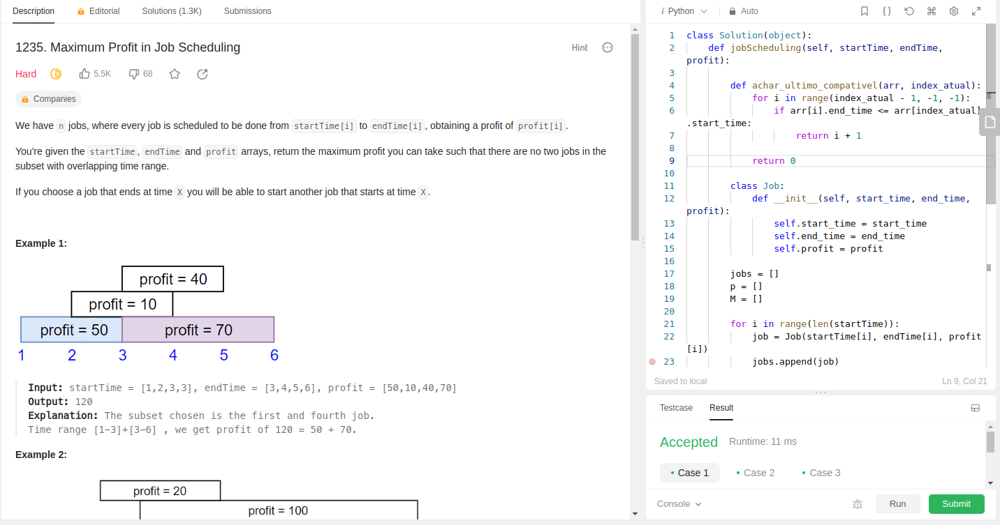
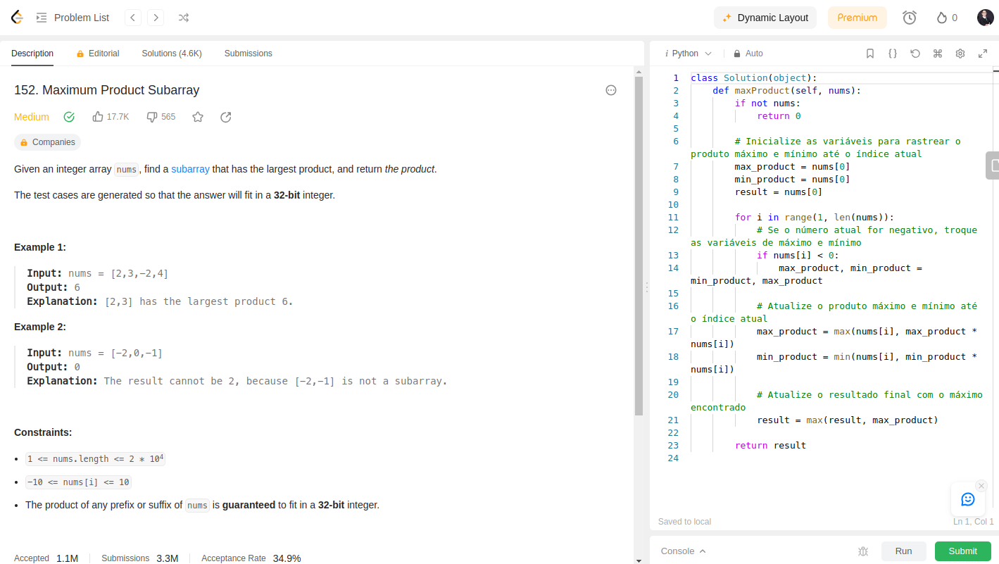
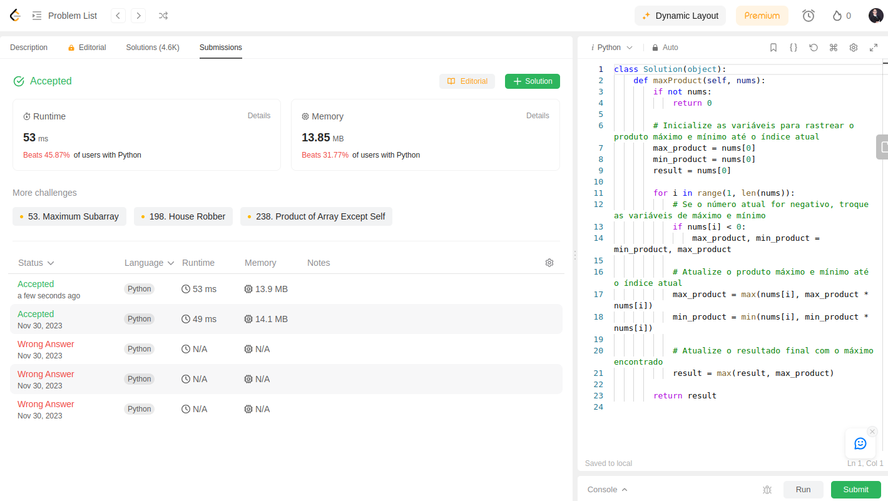
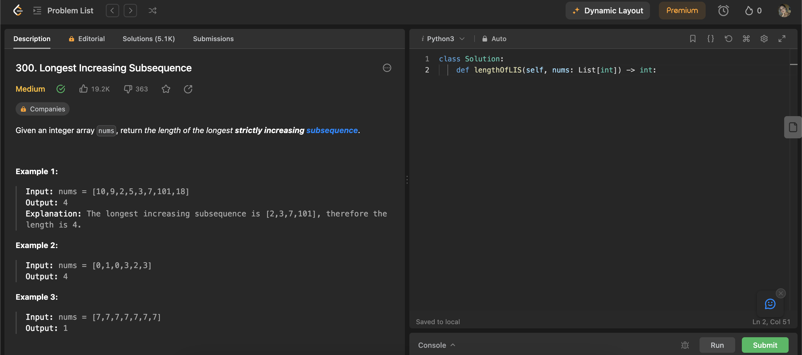
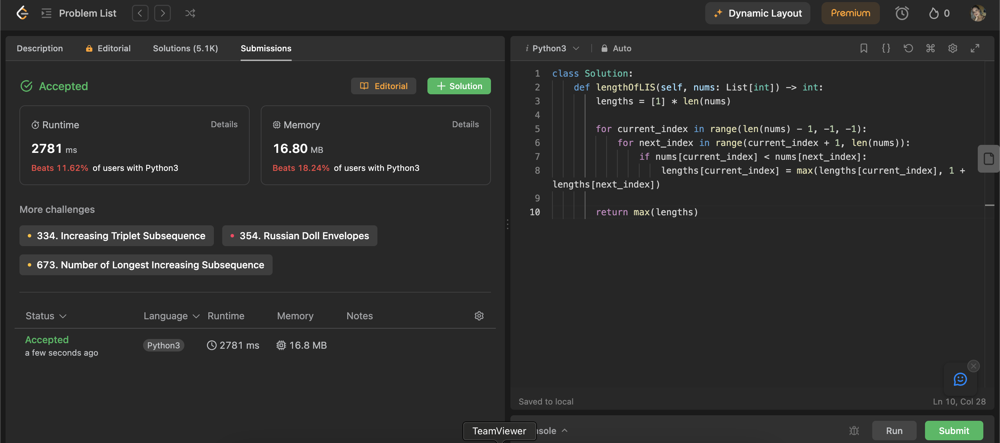
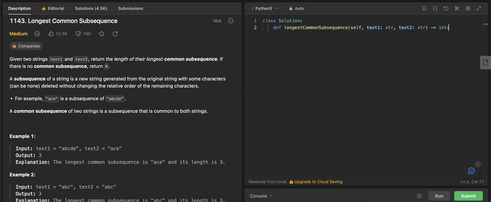
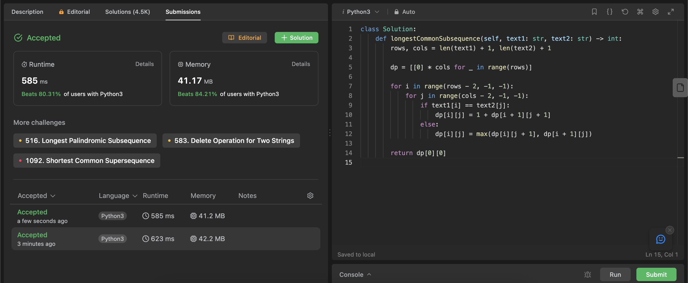

**Conteúdo da Disciplina**: PD<br>

## Alunos
|Matrícula | Aluno |
| -- | -- |
| 20/0025449  |  Natan Tavares Santana |
| 20/0036351  |  Clara Marcelino Ribeiro de Sousa |

## Sobre 
Resolução de exercicios de Juízes online que envolvam Programação dinâmica. Cada pasta dentro deste repositório tera a solução para um dos exercícios. O vídeo com a explicação dos exercícios pode ser encontrado nesse [repositório](apresentacao.mp4)

Exercícios Resolvidos:

|Nome | Dificuldade | Plataforma |
| -- | -- | -- |
| [1235. Maximum Profit in Job Scheduling](https://leetcode.com/problems/maximum-profit-in-job-scheduling/description/)  |  Hard | Leetcode |
| [152. Maximum Product Subarray](https://leetcode.com/problems/maximum-product-subarray/description/)  |  Medium | Leetcode |
| [300. Longest Increasing Subsequence](https://leetcode.com/problems/longest-increasing-subsequence/description/)  |  Medium | Leetcode |
| [1143. Longest Common Subsequence](https://leetcode.com/problems/longest-common-subsequence/description/)  |  Medium | Leetcode |

## Screenshots

### 1235. Maximum Profit in Job Scheduling



### 152. Maximum Product Subarray




### 300. Longest Increasing Subsequence



### 1143. Longest Common Subsequence



## Instalação 
**Linguagem**: Python<br>

É necessário ter Python3 instalado no computador.

## Uso 
Entre dentro de uma pasta de exercício e rode o comando:

```
python3 main.py
```


